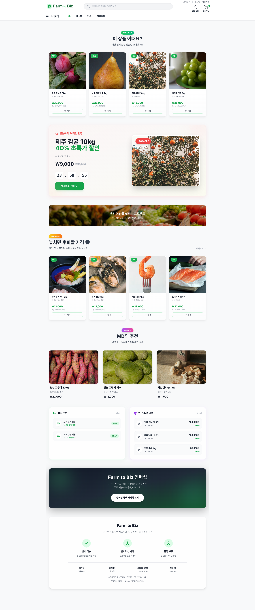
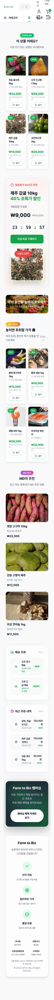

# 메인 대시보드 - 디자인 명세서

## 📱 화면 정보
- **페이지명**: 메인 대시보드
- **URL**: `01-HomePage`
- **작성일**: 2025. 12. 2.

---

## 🎨 디자인 시스템

### 색상 (Colors)
- **Primary**: #5B9A6F (녹색)
- **Secondary**: #fbbf24 (노란색 - 특가/할인)
- **Accent**: #ef4444 (빨간색 - 알림/품절)
- **Background**: #F8F9FA (연한 회색)
- **Text Primary**: #111827 (진한 회색)
- **Text Secondary**: #6B7280 (중간 회색)

### 타이포그래피 (Typography)
- **폰트**: Pretendard
- **헤딩 H1**: 32px / Bold (모바일: 24px)
- **헤딩 H2**: 24px / Bold (모바일: 20px)
- **헤딩 H3**: 20px / Bold (모바일: 18px)
- **본문**: 16px / Regular
- **캡션**: 14px / Regular
- **작은 텍스트**: 12px / Regular

### 간격 (Spacing)
- **섹션 간격**: 80px (모바일: 48px)
- **컨텐츠 간격**: 32px (모바일: 24px)
- **컴포넌트 간격**: 16px (모바일: 12px)

### 모서리 (Border Radius)
- **카드**: 16px
- **버튼**: 12px
- **입력창**: 8px
- **이미지**: 12px

### 그림자 (Shadows)
- **카드**: `0 8px 30px rgba(0,0,0,0.04)`
- **버튼 호버**: `0 4px 12px rgba(91,154,111,0.3)`
- **입력창**: `inset 0 2px 4px rgba(0,0,0,0.06)`

---

## 📐 레이아웃

### 반응형 브레이크포인트
- **Mobile**: < 640px
- **Tablet**: 640px ~ 1024px
- **Desktop**: > 1024px

### 컨테이너
- **최대 너비**: 1280px
- **좌우 패딩**: 32px (모바일: 16px)

---

## 🧩 주요 컴포넌트

### 버튼 (Button)
- **Primary**: 녹색 배경 (#5B9A6F) + 흰색 텍스트
- **Secondary**: 흰색 배경 + 회색 테두리
- **높이**: 48px (모바일: 44px)
- **패딩**: 24px (좌우)

### 카드 (Card)
- **배경**: 흰색
- **테두리**: 1px solid #E5E7EB
- **그림자**: 호버 시 상승 효과
- **패딩**: 24px

### 상품 카드 (ProductCard)
- **이미지 비율**: 1:1 (정사각형)
- **정보 영역**: 상품명 + 가격 + 장바구니 버튼
- **호버 효과**: 이미지 확대 (scale 1.05) + 그림자 강화

---

## 📸 스크린샷

### Desktop (1920x1080)

### Mobile (375x812)

---

## 💡 개발자 노트

### 주요 기능
- [ ] TODO: 이 섹션은 개발자가 구현해야 할 기능 목록입니다.
- [ ] Mock 데이터를 실제 API로 교체
- [ ] 상태 관리 추가 (Zustand/Redux)
- [ ] 에러 핸들링 추가

### 주의사항
- 이 디자인은 순수 UI/UX 템플릿입니다.
- 실제 기능 구현은 개발자가 진행해야 합니다.
- Mock 데이터 의존성 제거 필요 (`src/data/` 폴더)

---

**작성자**: Farm to Biz 디자인 팀
**문의**: GitHub Issues
